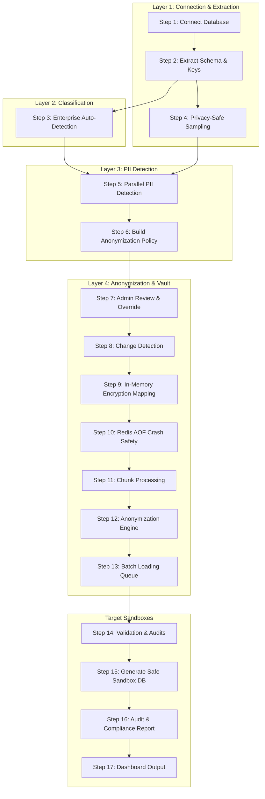

# Enterprise Data Anonymization System (12-Layer Structure, 17-Step Pipeline)

A comprehensive, production-grade privacy-preserving data anonymization platform designed for Indian enterprises. The system complies with the **DPDP Act 2023** (Digital Personal Data Protection Act, India), **RBI Guidelines**, **IRDAI**, and **TRAI** sector-specific regulations.

---

## 🗺️ Architectural Layers

The repository is organized into 12 distinct, sequential layers corresponding to the data pipeline execution flow:

```
Data-Anonymization/
├── Layer_01_Connection_Extraction/    # DB connection and metadata read
│   ├── database_connector.py          # SQLAlchemy connection manager
│   ├── schema_extractor.py            # Primary/Foreign Key metadata extractor
│   └── sample_extractor.py            # Column-wise random sampler (20-row limit)
│
├── Layer_02_Enterprise_Classification/# LLM-based industry classifier
│   └── enterprise_detector.py         # Detects category (BANKING, HEALTHCARE, etc.)
│
├── Layer_03_PII_Detection/            # Multi-engine PII detection layers
│   ├── combined_detector.py           # Merges LLM & heuristic regex results
│   ├── llm_pii_detection.py           # LLM-based batch column detector
│   ├── india_regex_patterns.py        # Aadhaar, PAN, GSTIN, Voter ID regex patterns
│   └── database_pii_detection.py      # PII orchestration manager
│
├── Layer_04_Change_Detection/         # Live database event detection
│   └── change_detector.py             # Event listener for INSERT/UPDATE schema shift
│
├── Layer_05_Redis_Hash_Vault/          # In-memory mapping & token vault
│   ├── redis_mapping.py               # Memory-optimized encrypted Redis/Local cache client
│   └── anonymizer.py                  # Tokenization, Masking, Hashing, and DP engines
│
├── Layer_06_Redis_AOF_Safety/         # Redis crash safety persistence layer
│   └── .gitkeep                       # Enforced appendonly & maxmemory noeviction configurations
│
├── Layer_07_Polling_Worker/           # Background polling worker
│   └── .gitkeep                       # 30-second scheduling worker
│
├── Layer_08_Destination_Loader/       # Transactional destination loading
│   └── policy_executor.py             # Recreates schema, streams chunk data, handles transactions
│
├── Layer_09_Validation_Engine/        # Data validation and risk scoring
│   └── .gitkeep                       # Validates schema preservation and type matches
│
├── Layer_10_Audit_Report/             # Compliance logging and audits
│   └── .gitkeep                       # Stores operation logs, applied techniques history, and generates audits
│
├── Layer_11_Admin_Dashboard/          # Admin human-in-the-loop review interface
│   └── admin_policy_service.py        # Service managing technique overrides & approval gates
│
└── Layer_12_Approval_Workflow/        # Production approval gating workflow
    └── .gitkeep                       # Approval status check block protecting sandbox insertion
```

---

## ⚙️ The 17-Step Data Anonymization Pipeline

The system executes the anonymization process in 17 distinct steps:



### Layer 1: Connect & Extract (Steps 1, 2, & 4)
* **Step 1: Connect Database**: Establishes a secure read-only transaction connection to the source database (e.g. PostgreSQL, MySQL, SQL Server, SQLite).
* **Step 2: Extract Schema & Keys**: Reflects database constraints, extracting primary/foreign keys, indexes, and unique columns.
* **Step 4: Privacy-Safe Column-Level Sampling**: Extracts random rows (up to 20) per column. Real data remains local to prevent exposure.

### Layer 2: Enterprise Classification (Step 3)
* **Step 3: Enterprise Auto-Detection**: Uses schema structure and columns context via LLM to classify the industry category (such as `BANKING`, `ECOMMERCE`, or `HEALTHCARE`) to determine compliance laws.

### Layer 3: PII Detection (Steps 5 & 6)
* **Step 5: PII Detection (LLM + Regex)**: Runs LLM batch matching and local India-specific regex checks in parallel.
* **Step 6: Build Anonymization Policy**: Recommends techniques prioritised by: Enterprise rules > Regex > LLM > Masking (default fallback).

### Layer 4: Anonymization & Vault (Steps 7 through 13)
* **Step 7: Admin Review & Approval**: Allows overriding techniques and locking the approved policy rules.
* **Step 8: Change Detection**: Listens to database events to track changes.
* **Step 9: In-Memory Transformation (Redis Hash Vault)**: Cryptographically maps original values to consistent fake values using Fernet-encrypted Redis vaults (or in-memory cache).
* **Step 10: Crash Safety (Redis AOF)**: Ensures mappings are saved and recoverable upon power loss/restart.
* **Step 11: Chunk Processing**: Divides records into chunk buffers (1K–10K rows) to optimise memory.
* **Step 12: Anonymization Engine**: Obfuscates data using Hashing (IDs), Tokenization/Faker (Names/Emails), Masking (Aadhaar/PAN), or Differential Privacy (Salary/Numerical).
* **Step 13: Batch Loading**: Queue management to write safely in batches.

### Validation & Output (Steps 14 through 17)
* **Step 14: Validation Engine**: Re-scans destination data, checking type preservation, row counts, and calculating a Privacy Risk Score (0-100).
* **Step 15: Generate Safe Database**: Writes target rows to the sandbox DB.
* **Step 16: Audit & Compliance Report**: Exports detailed counts audit and compliance status HTML/PDF.
* **Step 17: Output to Admin**: Dashboard displays audit stats, download links, and risk scores.

---

## 🛠️ Getting Started

### 1. Configure the Environment
Create a `.env` file in the root directory:
```ini
DB_TYPE=postgresql
DB_HOST=ep-gentle-wave-atqzagux.c-9.us-east-1.aws.neon.tech
DB_PORT=5432
DB_USERNAME=neondb_owner
DB_PASSWORD=your_password
DB_NAME=neondb
GITHUB_API_KEY=your_github_models_pat_here
LLM_PROVIDER=github
LLM_MODEL=gpt-4o
```

### 2. Install Dependencies
```bash
pip install -r requirements.txt
```

### 3. Run Pipeline Verification Test
To execute the pipeline, run the validation test:
```bash
python execute_anonymization_pipeline.py
```

---

## 🛡️ Indian PII & Compliance Laws

The system supports local regulatory checks for:
* **AADHAAR**: 12-digit Indian national identity number.
* **PAN**: 10-character alphanumeric Permanent Account Number.
* **GSTIN**: 15-character Goods and Services Tax Identification Number.
* **INDIAN_PHONE**: 10-digit mobile numbers starting with 6-9 (prefixed with +91).
* **VOTER_ID & DRIVING_LICENSE**: State-registered alphanumeric card formats.
