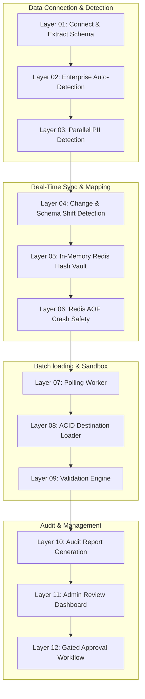

# Enterprise Data Anonymization System (12-Layer Pipeline)

A comprehensive, production-grade privacy-preserving data anonymization platform designed for Indian enterprises. The system complies with the **DPDP Act 2023** (Digital Personal Data Protection Act, India), **RBI Guidelines**, **IRDAI**, and **TRAI** sector-specific regulations.

---

## 🗺️ Architectural Layers

The repository is organized into 12 distinct, sequential layers corresponding to the data pipeline execution flow:

```
Data-Anonymization/
├── Layer_01_Connection_Extraction/    # DB connection and metadata read
│   ├── database_connector.py          # SQLAlchemy connection manager
│   ├── schema_extractor.py            # Primary/Foreign Key metadata extractor
│   └── sample_extractor.py            # Column-wise random sampler (20-row limit)
│
├── Layer_02_Enterprise_Classification/# LLM-based industry classifier
│   └── enterprise_detector.py         # Detects category (BANKING, HEALTHCARE, etc.)
│
├── Layer_03_PII_Detection/            # Multi-engine PII detection layers
│   ├── combined_detector.py           # Merges LLM & heuristic regex results
│   ├── llm_pii_detection.py           # LLM-based batch column detector
│   ├── india_regex_patterns.py        # Aadhaar, PAN, GSTIN, Voter ID regex patterns
│   └── database_pii_detection.py      # PII orchestration manager
│
├── Layer_04_Change_Detection/         # Live database event detection
│   └── change_detector.py             # Event listener for INSERT/UPDATE schema shift
│
├── Layer_05_Redis_Hash_Vault/          # In-memory mapping & token vault
│   ├── redis_mapping.py               # Memory-optimized encrypted Redis/Local cache client
│   └── anonymizer.py                  # Tokenization, Masking, Hashing, and DP engines
│
├── Layer_06_Redis_AOF_Safety/         # Redis crash safety persistence layer
│   └── (Auto-applied configurations to live Redis instance: appendonly, noeviction)
│
├── Layer_07_Polling_Worker/           # Background polling worker
│   └── (30-second scheduling worker)
│
├── Layer_08_Destination_Loader/       # Transactional destination loading
│   └── policy_executor.py             # Recreates schema, streams chunk data, handles transactions
│
├── Layer_09_Validation_Engine/        # Data validation and risk scoring
│   └── (Validates schema preservation, type matches, and calculates Privacy Risk)
│
├── Layer_10_Audit_Report/             # Compliance logging and audits
│   └── (Stores operation logs, applied techniques history, and generates audits)
│
├── Layer_11_Admin_Dashboard/          # Admin human-in-the-loop review interface
│   └── admin_policy_service.py        # Service managing technique overrides & approval gates
│
└── Layer_12_Approval_Workflow/        # Production approval gating workflow
    └── (Approval status check block protecting sandbox insertion)
```

---

## ⚙️ The 12-Layer Data Anonymization Pipeline

The system executes the anonymization process in 12 distinct layers:



### 1. Connection & Extraction (Layer 01)
* **database_connector.py**: Establishes a secure read-only transaction connection to the source database (PostgreSQL, MySQL, SQL Server, SQLite).
* **schema_extractor.py & sample_extractor.py**: Extracts primary/foreign keys, indexes, and draws a safe 20-row random sample per column to keep real PII local.

### 2. Enterprise Auto-Detection (Layer 02)
* **enterprise_detector.py**: Uses LLM context processing to categorize the database industry class (e.g. `BANKING`, `HR`, `HEALTHCARE`) and maps them to corresponding compliance laws (e.g. RBI, DPDP, HIPAA).

### 3. PII Detection (Layer 03)
* **database_pii_detection.py**: Runs local regex checks for Indian PII formats and LLM batch scanning in parallel. Generates a draft policy.

### 4. Change & Schema Shift Detection (Layer 04)
* **change_detector.py**: Listens to database events to intercept changes. Automatically triggers re-scans if schema shifts (new columns/tables) are detected and resets the policy to `"DRAFT"` until reviewed.

### 5. Redis Hash Vault (Layer 05)
* **redis_mapping.py & anonymizer.py**: Cryptographically maps original values to consistent fake values using Fernet-encrypted Redis Hashes (`HSET`/`HGET`). Zero raw PII is written to Redis. Falls back to a local memory cache if Redis goes offline, with automatic sync-back.

### 6. Redis AOF Safety (Layer 06)
* Automatically configures Redis AOF persistence (`appendonly yes`, `maxmemory-policy noeviction`) on startup to ensure crash safety and mapping history durability.

### 7. Polling Worker (Layer 07)
* Pools newly anonymized records and processes changes in batches every 30 seconds to optimize performance and reduce target database locks.

### 8. Destination Loader (Layer 08)
* **policy_executor.py**: Reads the approved policy, creates empty tables in the target sandbox database with adapted data types (e.g. changing `INTEGER` to `VARCHAR(64)` for hashed primary keys), and streams data in chunks.

### 9. Validation Engine (Layer 09)
* Compares source and destination row counts, verifies data type preservation, and executes a compliance scanner to check for PII leakage.

### 10. Audit Report (Layer 10)
* Records timestamped anonymization logs, column mappings metadata, and generates regulatory compliance HTML/PDF audit reports.

### 11. Admin Review Dashboard (Layer 11)
* **admin_policy_service.py**: Provides interfaces for administrators to review PII findings, manually override anonymization techniques, and approve/reject the policy.

### 12. Approval Workflow (Layer 12)
* Ensures that the anonymization engine refuses execution unless the active policy is in `"APPROVED"` status, maintaining strict human-in-the-loop security.

---

## 🛠️ Getting Started

### 1. Configure the Environment
Create a `.env` file in the root directory:
```ini
DB_TYPE=postgresql
DB_HOST=ep-gentle-wave-atqzagux.c-9.us-east-1.aws.neon.tech
DB_PORT=5432
DB_USERNAME=neondb_owner
DB_PASSWORD=your_password
DB_NAME=neondb
GITHUB_API_KEY=your_github_models_pat_here
LLM_PROVIDER=github
LLM_MODEL=gpt-4o
```

### 2. Install Dependencies
```bash
pip install -r requirements.txt
```

### 3. Run Pipeline Verification Test
To execute the pipeline, run the validation test:
```bash
python execute_anonymization_pipeline.py
```

---

## 🛡️ Indian PII & Compliance Laws

The system supports local regulatory checks for:
* **AADHAAR**: 12-digit Indian national identity number.
* **PAN**: 10-character alphanumeric Permanent Account Number.
* **GSTIN**: 15-character Goods and Services Tax Identification Number.
* **INDIAN_PHONE**: 10-digit mobile numbers starting with 6-9 (prefixed with +91).
* **VOTER_ID & DRIVING_LICENSE**: State-registered alphanumeric card formats.
